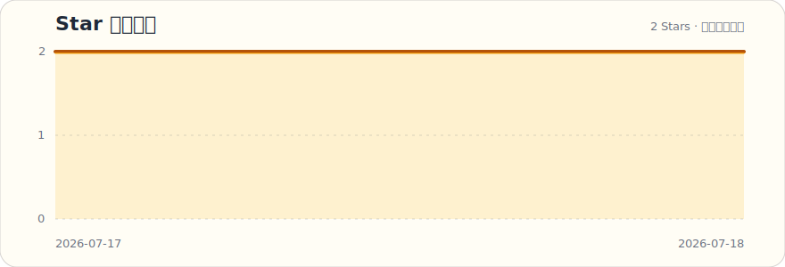

# 阿康的 Mac 贴贴

> 把窗口放到刚刚好的位置。一款开源、轻量的 macOS 贴窗工具。


## v1.0.1 更新说明

这次主要做了两件事：

- **重置 Project 工程配置**：清理旧工程遗留配置，解决此前偶发的启动、快捷键与构建异常。
- **新增跨屏贴边共享**：窗口已经贴在屏幕边缘时，再次按同方向快捷键，会保持对应贴边布局并跳到相邻显示器；适合双屏、多屏连续整理窗口。

## 功能

- **15 种窗口位置**：左/右/上/下半屏、四角、左右三等分、左右 2/3、全屏、居中。
- **跨屏贴边共享**：连续按同方向快捷键，可在相邻显示器之间延续贴边布局。
- **全局热键**：默认 `⌃⌥` 前缀，不抢焦点直接触发。
- **菜单栏常驻**：不占 Dock，轻量后台运行。

| 操作 | 默认快捷键 |
|------|-----------|
| 左半屏 / 跨到左侧屏幕 | ⌃⌥ ← |
| 右半屏 / 跨到右侧屏幕 | ⌃⌥ → |
| 上半屏 / 跨到上方屏幕 | ⌃⌥ ↑ |
| 下半屏 / 跨到下方屏幕 | ⌃⌥ ↓ |
| 左上角 | ⌃⌥ U |
| 右上角 | ⌃⌥ I |
| 左下角 | ⌃⌥ J |
| 右下角 | ⌃⌥ K |
| 全屏 | ⌃⌥ ↩ |
| 居中 | ⌃⌥ C |
| 左三等分 | ⌃⌥ D |
| 中三等分 | ⌃⌥ F |
| 右三等分 | ⌃⌥ G |
| 左 2/3 | ⌃⌥ E |
| 右 2/3 | ⌃⌥ T |

## 使用方式

当前提供下面两种方式；暂未提供需要单独参考的配套文档，因此不额外列出第三种方式。

### 方式一：直接下载我的开源版本

本项目完整源码公开。只想马上使用的话，直接前往 [Releases](../../releases) 下载最新版 `AkangMacTieTie-v1.0.1-macos.zip`，解压后将“阿康的 Mac 贴贴.app”拖入“应用程序”即可。

首次打开如被 macOS 拦截：按住 `Control` 点击 App，选择“打开”；随后在系统设置中授予“辅助功能”权限。应用采用 ad-hoc 本地签名，出现这一步是正常现象。

### 方式二：拉取代码，再交给 AI

适合希望自己编译、调整功能或排查问题的朋友。

```bash
git clone https://github.com/PMKang/Mac-TieTie.git
cd Mac-TieTie
./script/build_and_run.sh --verify
```

如果你的环境缺少 Xcode 或 XcodeGen，直接把下面这段 Prompt 连同报错交给 Codex、ChatGPT 或其他 AI 编程助手：

```text
我正在运行开源项目“阿康的 Mac 贴贴”（macOS 13+，Swift / AppKit / SwiftUI / XcodeGen）。
请先阅读 README.md、MacPastie/project.yml、MacPastie/AppDelegate.swift、
MacPastie/Core/HotkeyManager.swift 和 MacPastie/Core/WindowManager.swift。

我的目标是：在不改变 Bundle ID（com.akang.macpastie）、辅助功能授权逻辑和现有全局快捷键含义的前提下，
帮我完成构建或排查问题。请先解释原因并给出最小改动方案，再修改代码；
最后执行 ./script/build_and_run.sh --verify，并说明验证结果。
```

## 使用

1. 打开 App，菜单栏出现 `⊞` 图标。
2. 切换到任意窗口，按快捷键即可贴窗。
3. 需要跨屏时，先把窗口贴到某一边，再连续按同方向快捷键；窗口会沿对应边缘进入相邻屏幕。

## 关注作者

扫码关注微信公众号“**阿康AI探索号**”。

AI 工具、产品实测、开发记录和踩坑复盘，都会持续更新在这里。


## Star History

每天由 GitHub Actions 自动更新，无需额外安装插件或授权第三方服务。



## 本地构建

```bash
./script/package_release.sh
```

构建产物位于 `release/AkangMacTieTie-v1.0.1-macos.zip`。发布脚本会生成 Apple 芯片与 Intel Mac 都能运行的通用包。

## License

MIT
